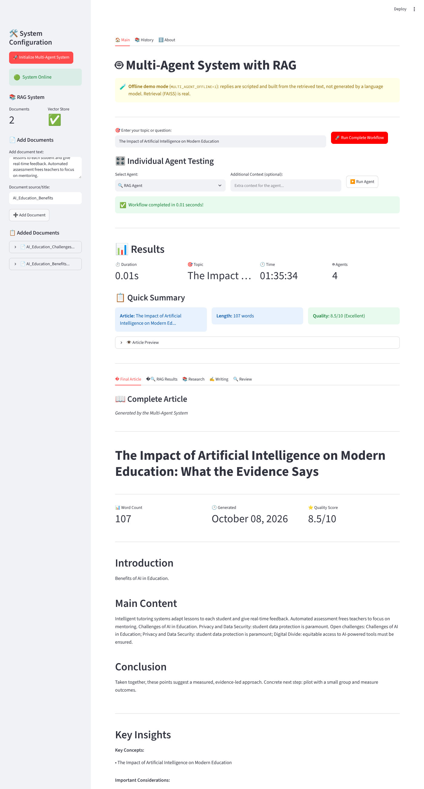

# Multi-Agent System with LangChain, Ollama and RAG

[](https://github.com/mehmetarifkuzgun/langchain-multi-agent-demo/actions/workflows/ci.yml)

Five cooperating agents (RAG, Research, Writer, Critic, Coordinator) built on LangChain LCEL. A FAISS
vector store grounds the answers in your documents, and a critic → writer **revision loop** improves the
article until it clears a quality threshold. Runs against a local Ollama model, or fully offline with a
scripted stand-in so you can try it (and run the tests) without any model.



> **Honesty note on the screenshot.** It was captured from the real Streamlit app in **offline demo mode**
> (`MULTI_AGENT_OFFLINE=1`): FAISS retrieval over the two documents added in the sidebar is real, but the
> agents' replies come from a deterministic `ScriptedLLM` (`offline.py`) that assembles JSON from the
> retrieved text. It is **not** model output, and the app says so in a banner. The Ollama path
> (`llama3.1:8b`) is implemented but was **not run** while preparing this README (no Ollama in the build
> sandbox).

## Architecture


Every agent is an LCEL chain, `PromptTemplate | llm | JSONOutputParser`, and all agents share one LLM
instance. The LLM and the embeddings are injectable (`MultiAgentSystem(llm=..., embeddings=...)`);
the default is `OllamaLLM` + `OllamaEmbeddings`, imported lazily.

The loop uses the settings that were already in `config.py` but were never wired up:
`enable_iterative_improvement`, `max_iterations` (3) and `quality_threshold` (8.0). Per-round scores are
recorded in the review's `metadata` (`scores_by_round`, `met_threshold`), so the shape of the result is unchanged.

## Quick start

**Without Ollama (offline demo, also what CI runs):**
```bash
pip install -r requirements.txt
MULTI_AGENT_OFFLINE=1 streamlit run streamlit_ui.py     # web UI
MULTI_AGENT_OFFLINE=1 python multi_agent_system.py      # CLI demo
```

**With Ollama:**
```bash
ollama pull llama3.1:8b && ollama serve
pip install -r requirements.txt
streamlit run streamlit_ui.py        # or: python multi_agent_system.py / python interactive_demo.py
```
Model names and the base URL live in `config.py` (`OLLAMA_MODEL`, `OLLAMA_EMBEDDING_MODEL`, `OLLAMA_BASE_URL`).

**As a library:**
```python
from multi_agent_system import MultiAgentSystem

system = MultiAgentSystem()                       # Ollama by default
system.add_documents_to_rag(["Your document..."], [{"source": "my-doc"}])
result = system.run_workflow("Your topic")        # dict of AgentResponse objects
print(result["review"].metadata["scores_by_round"])
```

## Tests

```bash
pip install -r requirements.txt pytest
pytest -q        # 19 tests, ~1 s, no network, no Ollama
```
They cover JSON parsing, FAISS retrieval (a privacy query retrieves the privacy chunk, a volcano query the
volcano chunk), each agent's JSON output, the revision loop (stops at the threshold, at `max_iterations`,
or when disabled) and a Streamlit `AppTest` smoke test. CI runs them on Python 3.11 and 3.12.

## Limitations

- Output quality with a real model depends on `llama3.1:8b` following the JSON format; the parser falls back
  to `{"content": text}` when it does not, and the critic's score is then unavailable (the loop stops).
- `langchain-community` (FAISS, loaders) prints a sunset deprecation warning; migrating to the standalone
  FAISS integration is the next step.
- The scripted offline model produces templated text; it demonstrates the plumbing, not writing quality.
- Uses one LLM for all roles; per-agent models are possible via the `llm=` argument but not exposed in the UI.

## Project structure

```
multi_agent_system.py   agents, LCEL chains, RAG, coordinator + revision loop, create_system()
offline.py              ScriptedLLM + HashingEmbeddings (offline demo and tests)
streamlit_ui.py         web UI          interactive_demo.py   CLI menu
config.py               models, workflow settings, prompts
tests/                  pytest suite    scripts/capture_screenshots.py  regenerates docs/img
```
